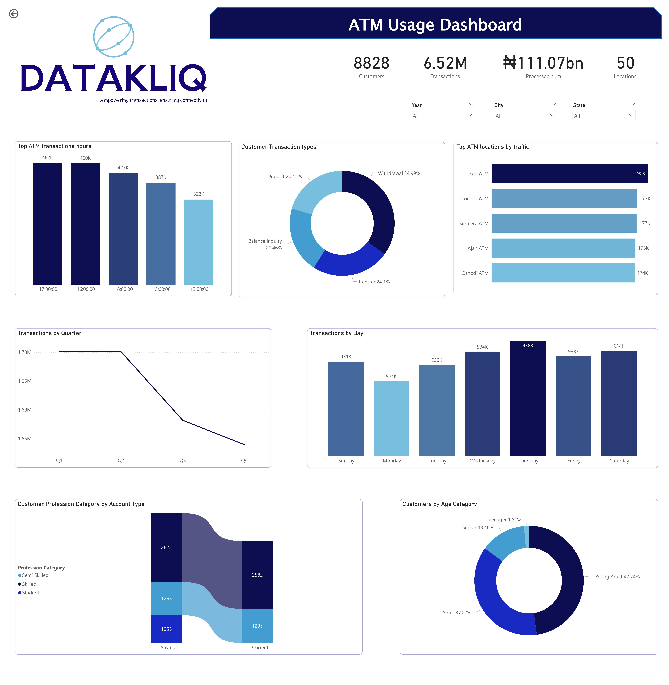

# Datakliq ATM Usage and Maintenance Dashboard

## Introduction
This is a SQL & Power BI project on a fictional financial dataset of a retail bank's ATM facilities across five states in Nigeria. The goal of the project is to understand the usage, performance and maintenance metrics of the ATM facilities in order to devise an optimization strategy.
## Problem statement
Management wants to understand ATM usage patterns, downtime assessment and transaction success rate. Among what management wants to determine are:
- Peak hours/days of ATM usage.
- Locations experiencing the highest ATM traffic.
- Seasonal trends in ATM usage.
- ATM Downtime frequency.
- Locations experiencing higher transaction failure rate.
## Skills demonstrated
The following SQL skills were incorporated into this project:
- Data manipulation and modification with SQL (INSERT INTO, UPDATE).
- Data cleaning with SQL using CTEs and Windows Function (WITH, DENSE_RANK()).
- Set operations, looping constructs and conditional logic (UNION, WHILE, DECLARE, BEGIN, END, CASE).

The following Power BI skills were incorporated into this project:
- Connection to SQL Server.
- Data transformation using Power Query Editor.
- Data modeling on Power BI.
- Knowledge of DAX and measures (SWITCH, RELATED, VAR, RETURN)
- Data visualization on Power BI.
## Data sourcing
The data sets was provided by DataKliq - an online educational institution helping people start their data journey. In homage to their invaluable contribution to the data space, the fictional retail bank was aptly named DATAKLIQ with the motto as "...empowering transactions, ensuring connectivity" `😄`. This [link](https://1drv.ms/u/s!AqSRjMFOmr0yk2QO22MdQJTigu1j?e=UAhalP) provides access to the data sets.
## Data transformation
The data sets were imported into SQL Server Managemnt Studio via the Import and Export Wizard.  A total of eleven (11) tables containing information about ATM transactions, Customers, ATM maintenance, ATM locations, Calendar and Hour lookup tables were imported.

The ATM transactions for all 5 states were merged and totaled 6,523,792 rows of data. A new calendar table was created to include all dates from 2019 to 2023 since the one provided did not.

Additionally, missing values in the ATM maintenance table were replaced with either the Mean or Mode value as appropriate.

Here's the complete [SQL query](https://github.com/emmywritescode/SQL-Queries/blob/main/DATAKLIQ%20ATM%20Performance%20Optimization.sql) used for the data transformation process.
## Data modeling
The model is a star schema. Overall, there are 7 dimension tables and 1 fact table (transactions) as seen below. For adequate analysis, a bridge table (ATM Id) containing unique ATM ids was created to build a relationship between the transactions table and the ATM maintenance table.

## Analysis and Visualization
Two report pages were prepared to show the ATM usage patterns separately from the ATM maintenance metrics. On the former, analysis revealed the following:
- A total of 6.52 million transactions was carried out by 8,828 customers in all five states over the entire period.
- At 462K, most transactions occurred around 17:00:00 or 5:00 pm.
- The 'Lekki ATM' was the most frequented by customers accounting for over 190K transactions.
- More transactions occurred during Q1 and Q2 compared to Q3 and Q4.

The ATM maintenance dashboard revealed the following:
- Overall, there was an Average Transaction Success Rate of 93.19% and an Average Error Rate of 1.82%
- The Average Downtime Frequency was 33% while the Average Dwell Time was 111.64 seconds.
- Apapa ATM had the highest transaction failure rate at 2.00%.

## Recommendations

